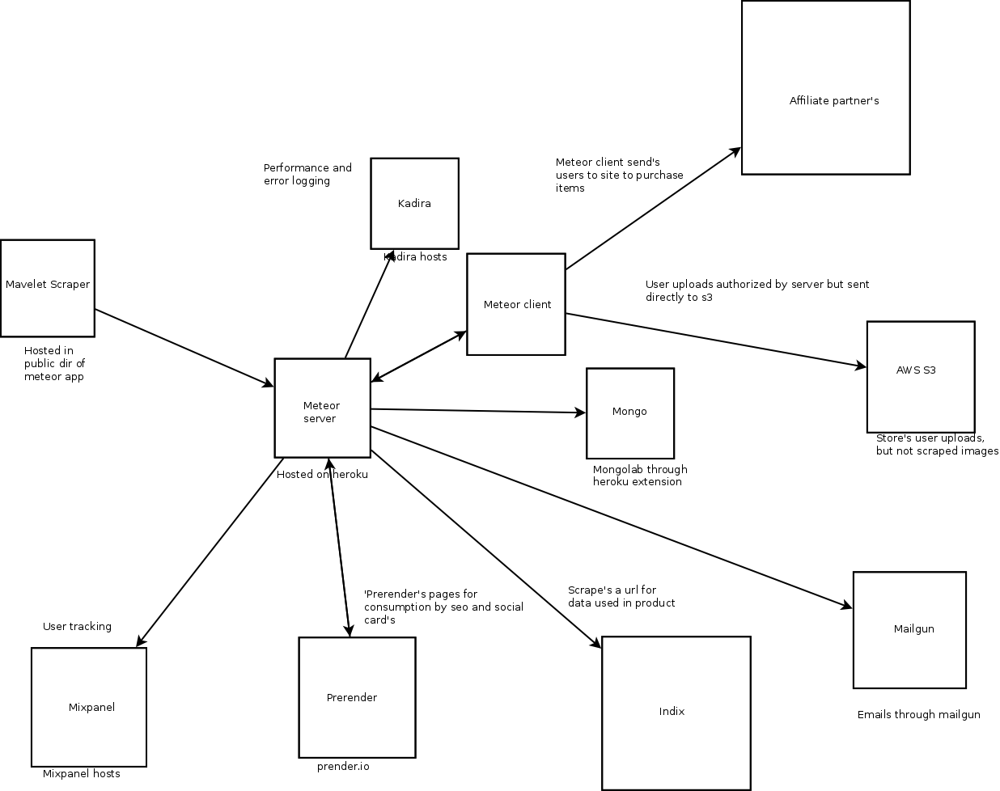
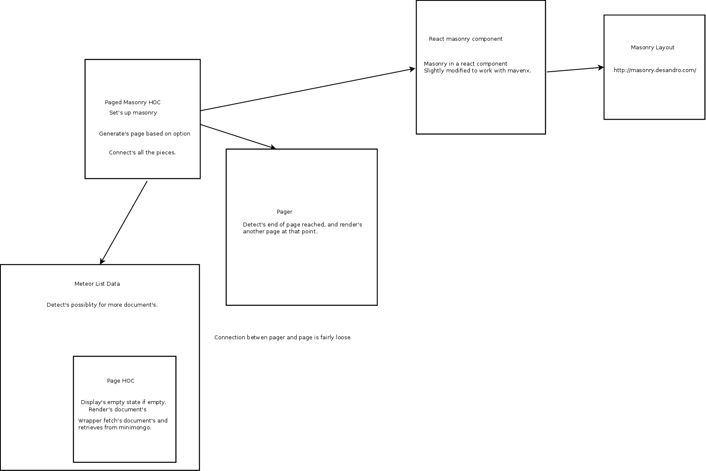
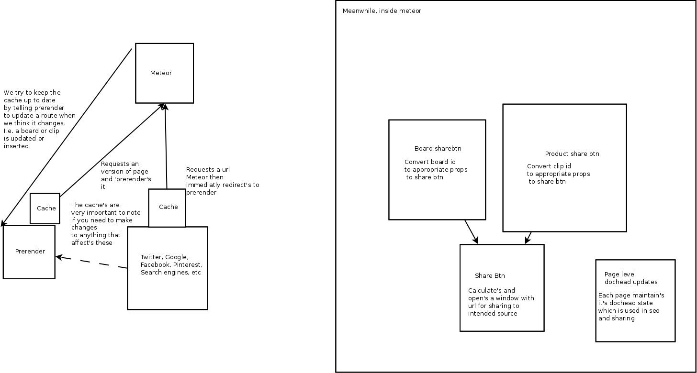

## Running Tests

    meteor test --driver-package=practicalmeteor:mocha --port 3010 --settings .deploy/dev-settings.json --verbose

## Architucture



### Why Meteor

Meteor provides a solid basis for a single page application.  It provides tight integration with NPM.  
A stack that is tightly integrated mean's the piece's can offer more than one that tries to be very generic.

Meteor target's realtime application's that provides users with a great experience.  A user can see their action's 
in many case's as a request is sent, rather than the norm of seeing them after a round trip to the server or 2.

Part of this magic is the 'database over the wire', in which an in browser version of minimongo is queried from,
and modified.

A package system that's aware of the build system and can hook into it can be used to provide an environment aware 
package, that will handle the wiring itself.  One such example is the `edgee:slingshot` package, which with minimal
configuration can securly upload files directly to your cloud storage of choice.  With NPM you would need to wire
it up manually, not only due to packages that don't detect client/server, but also due to not having a standard
transport mechanism.

### Why Aphrodite

Inline styles make it considerably easier to remove dead css, and have confidence when modifying a piece of code that your not breaking
something seemingly unrelated.  It also forces you and fellow developers to never target obscure elements deeper in the DOM than the 
component you're working on.  In general it makes things easier to reason about.

Benefits of Aphrodite over something like Radium.

- Pure css
- Cleaner DOM (primarily useful in dev)


Benefits of Aphrodite over something like CSS Modules

- Packaging.  Doesn't require another step in build process.
- Nothing special required to take a component using it, and run it. (i.e. no setting up fucking webpack)


## Modal

At it's core, we have a single modal, that get's contents fed to it through event horizon data.  A good example can be found at

```/imports/ui/components/clipboard/safari_modal.jsx```

The expected structure of a modal is

```
  <Content className="safari-modal">
    <Header />
    <Body>
      <Title>
        Some text
      </Title>

      The body of your modal.
    </Body>
    <Actions
      actions={[{
        label: 'Some button label',
        action: performCorrespondingAction,
      }]}
    />
  </Content>

```

## Masonry



The masonry component has quite a bit going on. Some of the goal's of the setup are

* Infinite scroll (ish, we don't remove from DOM, only slowly add to it)
* Use local data (minimongo).  This allows fast click to product.
* No list level reactivity (in most places, some need's it)
* Allow arbitrary sized tiles (standard width though)

## SSR (sharing and seo)



There are obviously several external system's at play here, be aware of cache's. 
Many of the external part's (facebook, pinterest, google) have debugging tool's 
so you can see what they see.


# Why

## Storybook

Problem to solve
- Visual regressions, nearly impossible to test in automated fasion
- Cross browser testing (still doesn't do a ton for animations, though we have few of those)
- Can actually speed up development down the road, initially will likely be a bit slower.
- Easier to test visually and in different states, more likely to get done and faster to do it.

Potential future benefits
- I think this will lend well to an automated visual regression flagging (potential regressions getting flagged and a human getting prompted).

Drawbacks
- Probably the biggest, have to work around meteor packages not working with storybook.
- Not what we're currently doing, and will take time to get on same page, probably as we go along. Regressions will happen in this refactor effort.
- Somewhat non-standard, less people familiar with it.  
- Requires a bit extra code (pretty small)

## Aphrodite

- Actually independent components.  I can't emphasize the absurd power this brings.
- Doesn't allow developers to have the spaghetti CSS we currently have.
- Benefits of inline styles without the majority of downsides.

## Meteor

# Dependencies
    
    // Provides a button that set's clipboard text on click
    "clipboard": "^1.5.12",

    // Not sure, meteor core, don't think we ever ref directly though
    "fibers": "^1.0.13",

    // Not sure, assume it's for babel/es6 import functionality?
    "imports": "^1.0.0",

    // DOM query's
    "jquery": "^2.2.4",

    // Fallback datepicker when input type="date" not supported
    "jquery-datepicker": "^1.11.5",
    
    // datepicker depend's on this
    "jquery-ui": "^1.12.0",

    // Replacement for underscore, should probably remove
    "lodash": "^4.13.0",

    // Not sure, meteor core something
    "meteor-node-stubs": "^0.2.3",

    // Browser mixpanel track
    "mixpanel-browser": "^2.7.2",

    // Email templating
    "mjml": "^2.2.0",

    // Not sure
    "mobx": "*",

    // Not sure
    "module": "^1.2.5",

    // Date manipulation
    "moment": "^2.13.0",

    // Better timezone support to integrate with moment
    "moment-timezone": "^0.5.4",

    // bleh
    "npm": "^3.9.5",

    // Carousel that works with react
    "nuka-carousel": "^1.2.1",

    // Not sure
    "query-string": "^4.2.2",

    // Who know's what react does
    "react": "^15.1.0",

    // mixin similar to shallow compare
    "react-addons-pure-render-mixin": "^15.1.0",

    // Can significantly reduce extra work done by react
    // Not used as much as we should currently though
    "react-addons-shallow-compare": "^15.0.2",

    // Input for currency, makes use of mask
    "react-currency-masked-input": "^1.0.2",

    // Provides component with it's dimensions
    "react-dimensions": "^1.2.0",

    // react DOM
    "react-dom": "^15.0.2",

    // Multi line truncation
    "react-dotdotdot": "^1.0.15",

    // Add data wrapper to component
    "react-komposer": "^1.8.0",

    // Animation support
    "react-motion": "^0.4.4",

    // Mount a react component
    "react-mounter": "^1.2.0",

    // Popover component
    "react-popover": "^0.4.4",

    // Linter for scss
    "stylelint-scss": "^1.1.1",

    // Not sure
    "valid-url": "^1.0.9"
